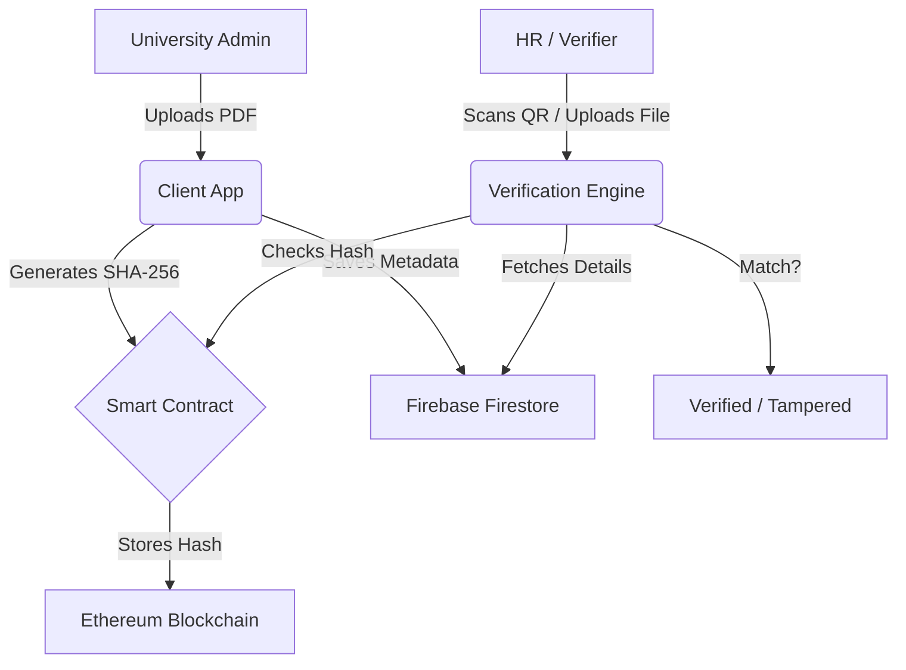

# 🎓 CertChain: Blockchain-Powered Certificate Verification

> **Secure. Transparent. Immutable.**
> CertChain is a next-generation platform for issuing and verifying academic and professional certificates using Ethereum-based blockchain technology.

---

## 🚀 Overview

CertChain solves the global problem of "Degree Fraud" by providing a cryptographic guarantee of certificate authenticity. Instead of relying on manual verification or physical stamps, CertChain uses **SHA-256 hashing** and **Smart Contracts** to store digital fingerprints of certificates on the **Sepolia Testnet**.

### **Key Features**
- **🛡️ Tamper-Proof**: Certificates are hashed; even a single pixel change invalidates the verification.
- **🔗 On-Chain Verification**: Real-time querying against Ethereum Smart Contracts.
- **📸 Smart QR Scanning**: Automated PDF/Image scanning using `jsQR` and `PDF.js`.
- **⚡ AI Extraction**: Leverages Google Gemini 2.0 to automatically extract certificate metadata.
- **🎨 Premium UI**: Modern, glassmorphic design built with Tailwind CSS and Radix UI.

---

## 🏗️ Architecture



---

## 🛠️ Tech Stack

- **Frontend**: [Next.js 15](https://nextjs.org/) (App Router), [React](https://reactjs.org/)
- **Styling**: [Tailwind CSS](https://tailwindcss.com/), [Shadcn UI](https://ui.shadcn.com/)
- **Blockchain**: [Ethers.js](https://docs.ethers.org/), Solidity, [Sepolia Testnet](https://sepolia.etherscan.io/)
- **Backend**: [Firebase](https://firebase.google.com/) (Auth, Firestore)
- **AI**: [Google Genkit](https://js.genkit.dev/) + [Gemini 2.0 Flash](https://deepmind.google/technologies/gemini/)
- **Utilities**: [PDF.js](https://mozilla.github.io/pdf.js/), [jsQR](https://github.com/cozmo/jsQR)

---

## ⚙️ Installation & Setup

1. **Clone the repository:**
   ```bash
   git clone https://github.com/rahulj-2006/Blockchain-certificate-verification.git
   cd Blockchain-certificate-verification
   ```

2. **Install dependencies:**
   ```bash
   npm install
   ```

3. **Environment Variables:**
   Create a `.env` file in the root directory:
   ```env
   # Firebase Config
   NEXT_PUBLIC_FIREBASE_API_KEY=your_api_key
   NEXT_PUBLIC_FIREBASE_AUTH_DOMAIN=your_project.firebaseapp.com
   NEXT_PUBLIC_FIREBASE_PROJECT_ID=your_project_id
   NEXT_PUBLIC_FIREBASE_STORAGE_BUCKET=your_project.appspot.com
   NEXT_PUBLIC_FIREBASE_MESSAGING_SENDER_ID=your_id
   NEXT_PUBLIC_FIREBASE_APP_ID=your_app_id

   # Blockchain Config
   NEXT_PUBLIC_BLOCKCHAIN_RPC_URL=https://eth-sepolia.g.alchemy.com/v2/your_key
   NEXT_PUBLIC_BLOCKCHAIN_CONTRACT_ADDRESS=0xyour_contract_address

   # AI Config
   GOOGLE_GENAI_API_KEY=your_gemini_key
   ```

4. **Run the development server:**
   ```bash
   npm run dev
   ```

---

## 📄 License

Distributed under the MIT License. See `LICENSE` for more information.

---

## 🤝 Contributing

Contributions are what make the open-source community such an amazing place to learn, inspire, and create. Any contributions you make are **greatly appreciated**.

1. Fork the Project
2. Create your Feature Branch (`git checkout -b feature/AmazingFeature`)
3. Commit your Changes (`git commit -m 'Add some AmazingFeature'`)
4. Push to the Branch (`git push origin feature/AmazingFeature`)
5. Open a Pull Request

---

**Developed with ❤️ for the Blockchain Hackathon.**
